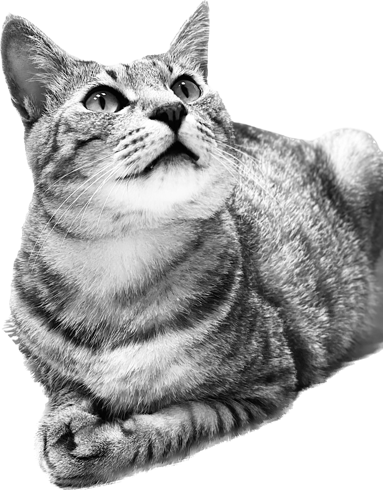

# 자기소개

## 이름
이시은(李侍恩) 

## 지원하게 된 계기 
 저는 비전공자로 다른 직종에서 근무하다 다소 고무감을 느껴 전공을 바꾸어 전문적인 업무를 하고 싶다는 욕심이 생겼습니다. 여러 분야들 중에 개발 분야, 특히 백엔드 쪽에 관심이 생겨 지원하게 되었습니다. ~~(개발 직종에 근무하는 친구들의 조언 및 추천도 있었습니다."너는 백엔드 체질이야.." '뭘 봐서..?')~~

## 앞으로의 포부
개발 관련한 공부들을 했던 적이 전무하지만 느리더라도 꾸준히 공부하여 실무에서도 잘할 수 있는 개발자가 되고 싶습니다. 물론 어려운 부분들이 많을 거라고 생각하지만 멘토님들과 강사님, 같이 공부하는 팀원들과 함께 한다면 가능할 것이라고 생각합니다. 앞으로 최선을 다해서 열심히 공부하고 싶습니다. 많이 도와주신다면 감사하겠습니다. (__).

## MBTI Talk
저는 MBTI가 대중화된 이래로 어떤 테스트를 해도 INTJ만 나오는 **인간 INTJ** 입니다.   
MBTI에 부정적이신 분들도 있을 것으로 알지만, 처음 만나는 사람들과 조금 더 빨리 가까워 질 수 있고, 어느정도는 서로를 알고 대화할 수 있는 훌륭한 지표라고 생각합니다. 개인적으로는 주변의 F 친구들을 이해할 수 있게 되어 아주 긍정적으로 생각하는 성격유형검사입니다. 

## TMI 남발
- 고양이를 키우고 있다. (총 3마리.)
- **한화 이글스**의 팬이다.
- 목소리가 좋고 말을 잘한다. (?)
- 친구들 때문에 올해 뜨개질을 시작했다.
- 운동을 좋아한다. ~~(헬스..)~~
- 언젠가는 악기 하나를 마스터하겠다는 열망을 품고 살아가고 있다.

## 마치며..

저희 집 고양이 보고 가세요..  

